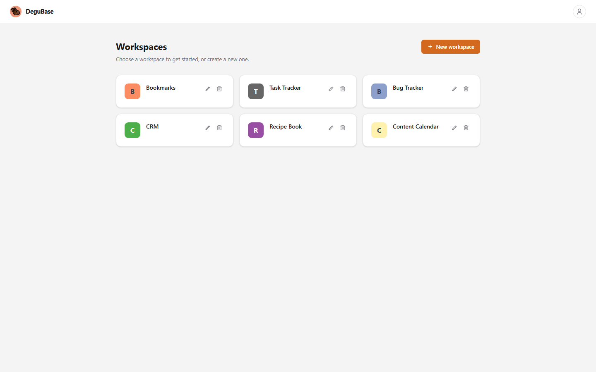
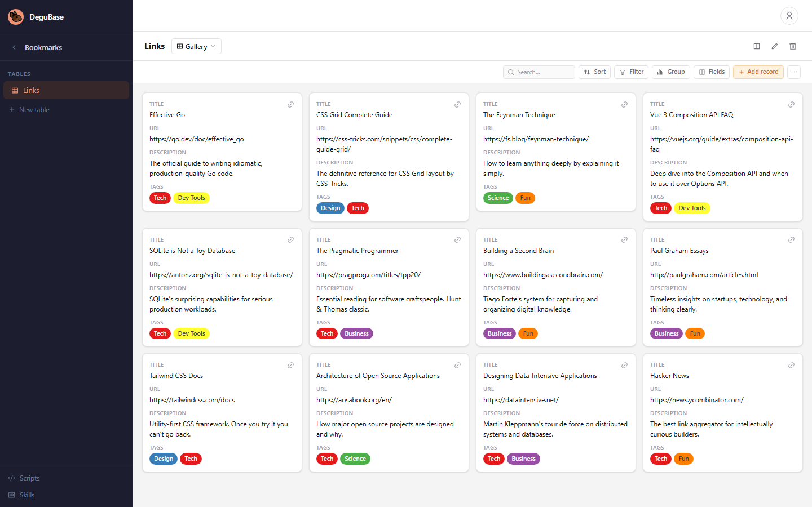
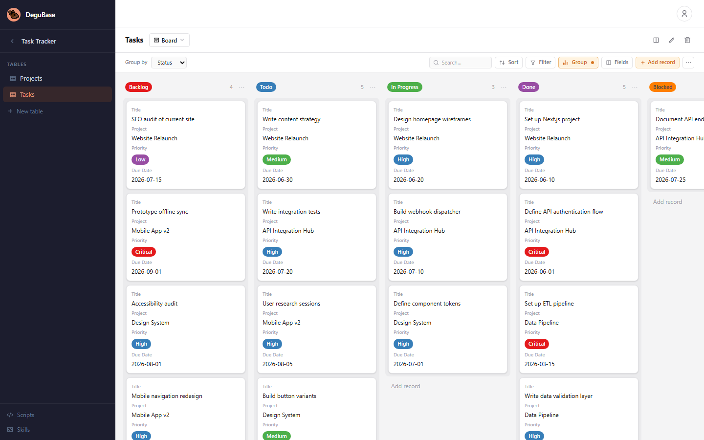
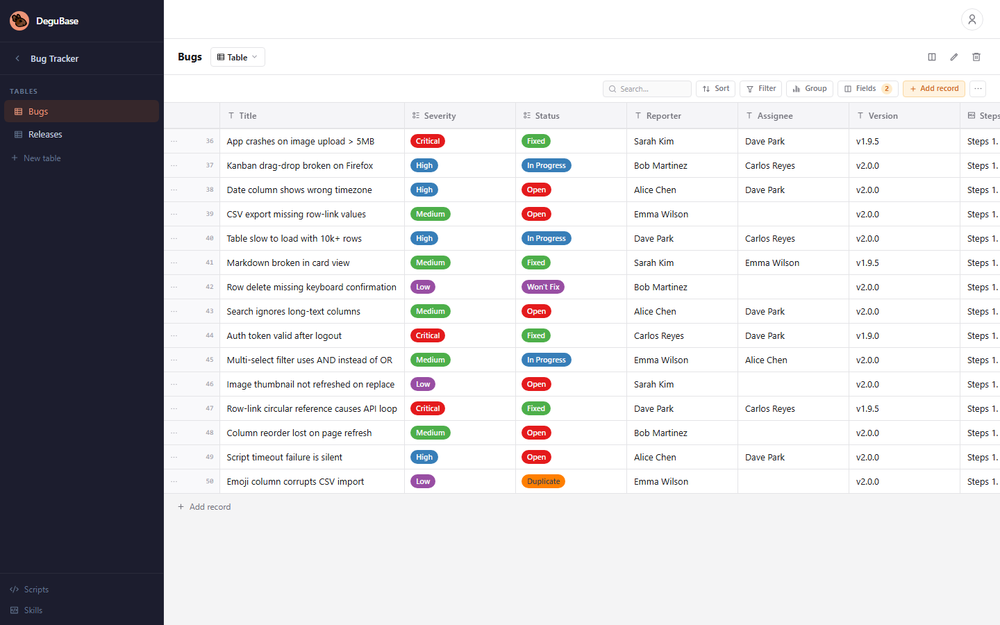
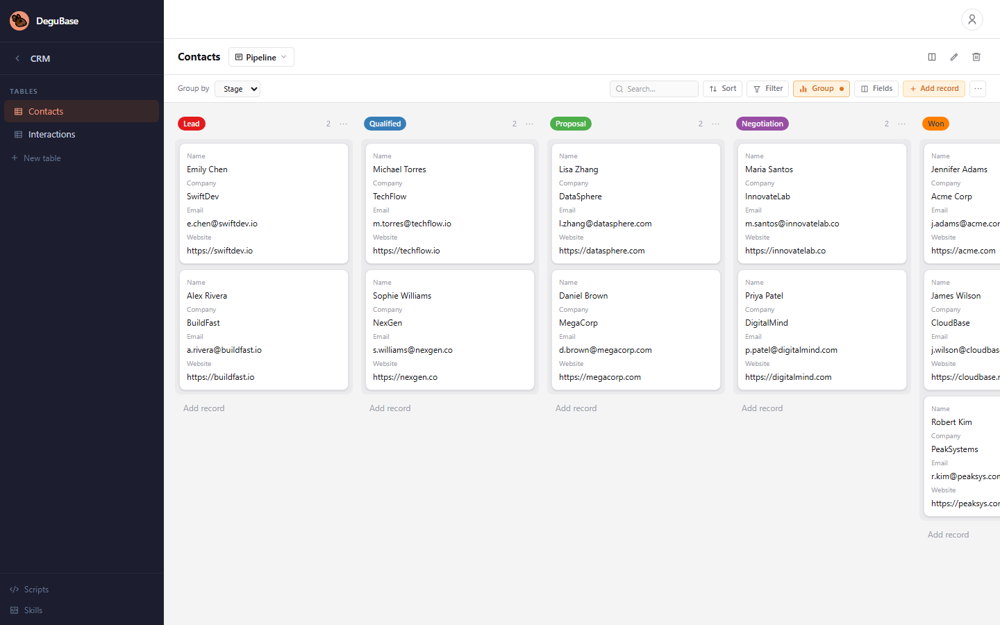
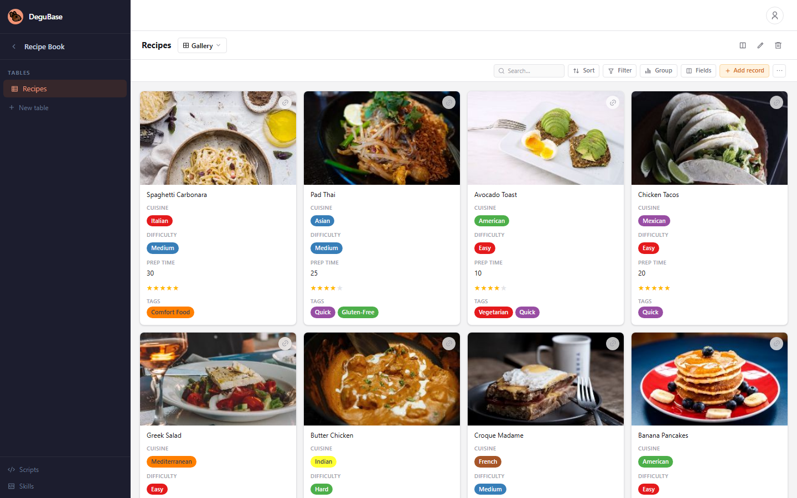
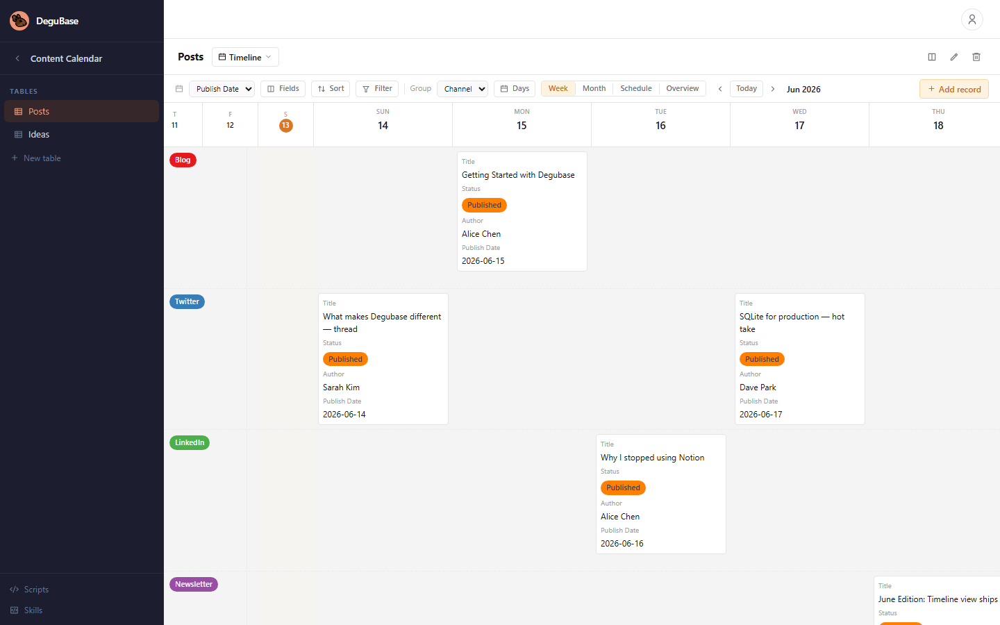
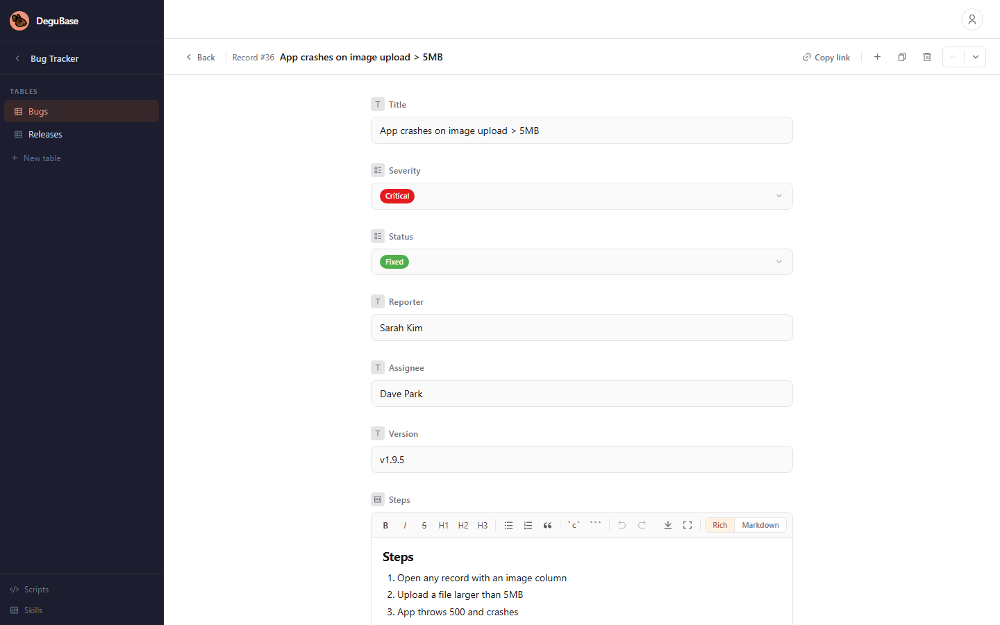

# Degubase

**The database UI for the masses.** A personal database that anyone can spin up in seconds — no accounts, no limits, no complexity. Just you and your data.

## Why?

We all have data to wrangle. Spreadsheets feel like overkill, databases feel like underkill, and every hosted tool wants your email, your credit card, and your soul. Degubase is the anti-platform: a single binary that gives you a full-featured database with a clean web UI, sitting right on your machine. Own your data. Share it with your small team. Write scripts that react to changes. No lock-in, no limits.

Degubase is **not** built for massive scale, enterprise authorization matrices, or real-time collaboration à la Google Docs. It's built for hackers, small teams, side projects, and personal tooling — a database that's yours, end to end.

## Core Features

- **Workspaces** — Isolated containers for your projects. Give each one a name and semantic context so both humans and agents understand what it's for.
- **Tables with typed columns** — 20+ column types: text, long-text, markdown, email, URL, number, currency, percent, rating, date, datetime, checkbox, single/multi-select, checklist, file, image, emoji, symbol, row-link, and auto-timestamps.
- **Tabular view** — Spreadsheet-style grid with inline cell editing, column controls, and row CRUD. The default view every table gets.
- **Kanban view** — Card-board grouped by a single-select column. Drag, drop, and manage workflows visually.
- **Card view** — Gallery layout with configurable fields, ideal for browsing image-heavy or detail-light records.
- **Matrix view** — Cross-reference two columns as X/Y axes, perfect for comparison grids and relationship mapping.
- **Linked records** — Connect rows across tables *or within the same table*. Reference a task's assignee, a project's owner, an invoice's client — or create parent/child hierarchies where rows link to other rows in the same table (e.g. task dependencies). Click any link to jump straight to the related record. The backend detects circular references and blocks deletion of rows that are still referenced. Great for relational data without the SQL.
- **Lua scripting** — Attach Lua scripts to tables that fire on row create/update/delete events. Transform data, enforce rules, or trigger side effects — all scriptable.
- **CSV import/export** — Bring data in, take data out. Filter and sort before exporting.
- **File & image uploads** — Attach files and images to records. Automatic thumbnail generation for images.
- **Real-time updates** — Server-sent events (SSE) stream live changes so your UI stays in sync.
- **User authentication** — JWT-based login with bcrypt-hashed passwords. Optional — disable auth entirely for local use.
- **Workspace API tokens** — Scoped bearer tokens for scripted access, agent integration, or sharing with a teammate.
- **Row history** — Every change tracked with revision IDs. Annotations supported.
- **OpenAPI spec** — Auto-generated OpenAPI 3.0 spec at `/api/openapi.json`. Import into Postman, Hoppscotch, or any OpenAPI-compatible tool.
- **Single binary** — Go backend embeds the Vue frontend. Ship one file, run it, you're done.

## Installation & Running

### Quickstart (Go)

```bash
git clone https://github.com/saintedlama/degubase.git
cd degubase
go run ./cmd/server
```

Opens on `http://localhost:8080`. A SQLite database (`degubase.db`) is created automatically on first run.

### Docker Compose

```bash
git clone https://github.com/saintedlama/degubase.git
cd degubase
docker compose up -d
```

### Configuration

Configure via `degubase.yaml` in the working directory, or environment variables:

| YAML key       | Env variable        | Default   | Description                    |
|---------------|---------------------|-----------|--------------------------------|
| `port`        | `DEGUBASE_PORT`     | `8080`    | HTTP listen port               |
| `data_dir`    | `DEGUBASE_DATA_DIR` | `data`    | Data & SQLite storage path     |
| `jwt_secret`  | `DEGUBASE_JWT_SECRET`| *(auto)* | Secret for signing JWT tokens  |
| `disable_auth`| `DEGUBASE_DISABLE_AUTH` | `false` | Skip login, auto-create admin  |

## Showcase


*Six demo workspaces: Bookmarks, Task Tracker, Bug Tracker, CRM, Recipe Book, Content Calendar.*

---


*Card view with configurable fields — title, URL, description, tags, status, and rating.*

---


*Kanban grouped by status with 18 tasks across multiple projects.*

---


*Tabular view with 15 bugs — severity, status, reporter, assignee, and markdown steps.*

---


*Sales pipeline from Lead to Won/Lost, with deal values and company tags.*

---


*Card gallery with cover images, cuisine, difficulty, prep time, rating, and tags.*

---


*Timeline view with swimlanes grouped by channel (Blog, Twitter, LinkedIn, Newsletter, YouTube).*

---


*Full record view with markdown rendering, column data, and row actions.*

#### Data types that work for you

20+ column types so your schema matches your mental model: `text`, `long-text`, `markdown`, `email`, `url`, `number`, `currency`, `percent`, `rating`, `date`, `datetime`, `checkbox`, `single-select`, `multi-select`, `checklist`, `file`, `image`, `emoji`, `symbol`, `row-link`, `created-at`, `updated-at`.

#### Multiple views on the same data

Four view types to match how you think about your data:

- **Tabular** — Fast spreadsheet-style editing with click-to-edit cells, column controls, and row context menus. Every table gets one by default.
- **Kanban** — Card-board grouped by any single-select column. Drag cards between columns to update the grouping field.
- **Card** — Gallery layout with configurable fields. Choose which columns to show, toggle labels, set truncation. Ideal for browsing image-heavy records or lightweight directories.
- **Matrix** — Cross-reference two columns as X/Y axes. Map relationships, build comparison grids, or sketch out a pivot-style view.

#### Linked records

The `row-link` column type connects rows across tables *or within the same table*. Reference a task's assignee, a project's owner, an invoice's client. Or create **parent/child hierarchies** — link a task to its parent task, a page to its parent page — within the same table. Click any link to jump straight to the related record. The backend graph API lets agents traverse these connections programmatically with cycle-safe BFS traversal, configurable depth, and ghost nodes for orphaned references.

#### Lua scripting engine

Attach Lua scripts to tables that trigger on `create`, `update`, or `delete` events. Scripts have access to the current row and can read/write other rows. Perfect for validation rules, derived fields, cross-table cascades, webhooks, and workflow automation. Each workspace gets its own set of environment variables (with secret support) so scripts can keep API keys and config out of the code.

#### CSV import/export

Bring in legacy data or share with tools that speak CSV. Filter and sort on export so you only get what you need.

#### File attachments & images

Upload files and images directly into record cells. Thumbnails are auto-generated for images. Files are served straight from the DB with proper MIME types and cache headers.

#### Real-time streaming

Server-sent events push live changes to every connected client. Watch your Kanban board update as teammates move cards without refreshing a thing.

#### Identity & access

- **Password auth** — JWT-based login with bcrypt-hashed passwords. Toggle `disable_auth: true` for single-user local setups.
- **Workspace tokens** — Scoped bearer tokens for API access. Create one per integration or teammate. Tokens are SHA-256 hashed and never stored in plaintext.
- **OpenAPI spec** — Every endpoint documented. Import `/api/openapi.json` into Postman, Hoppscotch, or any OpenAPI tool. Perfect for LLM agents that need to discover the API at runtime.

#### Row history

Every edit is tracked with a revision ID. View change history per row. Add annotations to capture context about why a change was made.

#### Designed for agents

Workspaces and tables carry a `context` field — a free-text semantic description that lets LLMs and automation tools understand your schema before they touch a single row. Pair that with the OpenAPI spec and workspace tokens, and Degubase doubles as a structured memory layer for AI agents.

#### Single binary, zero dependencies

One Go binary embeds the entire Vue frontend. Download it, run it, and you have a full database application. SQLite means no database server to install. Everything lives in a single file or one data directory.

## Developing

Degubase is a Go backend with a Vue 3 frontend.

```bash
git clone https://github.com/saintedlama/degubase.git
cd degubase
```

### Prerequisites

- [Go](https://go.dev) 1.25+
- [pnpm](https://pnpm.io) (frontend dependencies)
- [air](https://github.com/air-verse/air) (backend live reload)

### Start development servers

```bash
make dev
```

This starts the Go backend with live reload on `:8080` and the Vue dev server with HMR, proxying API calls to the backend.

### Run tests

```bash
make test          # Go unit + integration tests
make e2e           # Playwright end-to-end smoke tests
make e2e-ui        # Playwright interactive UI for e2e tests
```

### Other targets

```bash
make build         # Production binary + Vue bundle
make seed          # Populate database with synthetic data for UI development
make coverage      # Test coverage report with treemap SVG
make db-reset      # Wipe and recreate local database
make clean         # Remove build artifacts and local database
```

### Project layout

```
cmd/server/       Application entrypoint
internal/
  api/            HTTP router, auth middleware
  automation/     Lua scripting engine, script CRUD, execution runner
  identity/       Users, auth, workspace tokens
  infrastructure/ Shared plumbing (events, storage, HTTP helpers)
  models/         Shared data types
  records/        Row CRUD, CSV, files, graph, SSE events
  schema/         Tables, columns, views
ui/               Vue 3 frontend (Vite, Vue Router)
e2e/              Playwright end-to-end tests
docs/             OpenAPI spec (auto-generated)
```

### API quick reference

```bash
# Create a workspace
curl -X POST localhost:8080/api/workspaces \
  -H "Content-Type: application/json" \
  -d '{"name":"my-project","context":"Project tracking"}'

# Create a table
curl -X POST localhost:8080/api/workspaces/1/tables \
  -H "Content-Type: application/json" \
  -d '{"name":"tasks","context":"Task items"}'

# Add a column
curl -X POST localhost:8080/api/workspaces/1/tables/1/columns \
  -H "Content-Type: application/json" \
  -d '{"name":"status","type":"single-select","options":{"choices":["todo","in progress","done"]}}'

# Insert a row
curl -X POST localhost:8080/api/workspaces/1/tables/1/rows \
  -H "Content-Type: application/json" \
  -d '{"data":{"status":"todo","title":"Ship it"}}'
```

Full API docs at `http://localhost:8080/api/openapi.json` when the server is running.

## Tech stack

| Layer    | Choice | Why                                           |
|----------|--------|-----------------------------------------------|
| Backend  | Go     | Fast, single binary, excellent HTTP tooling   |
| Database | SQLite | Zero-setup, file-based, perfect for local use |
| Frontend | Vue 3  | Reactive, lightweight, composable             |
